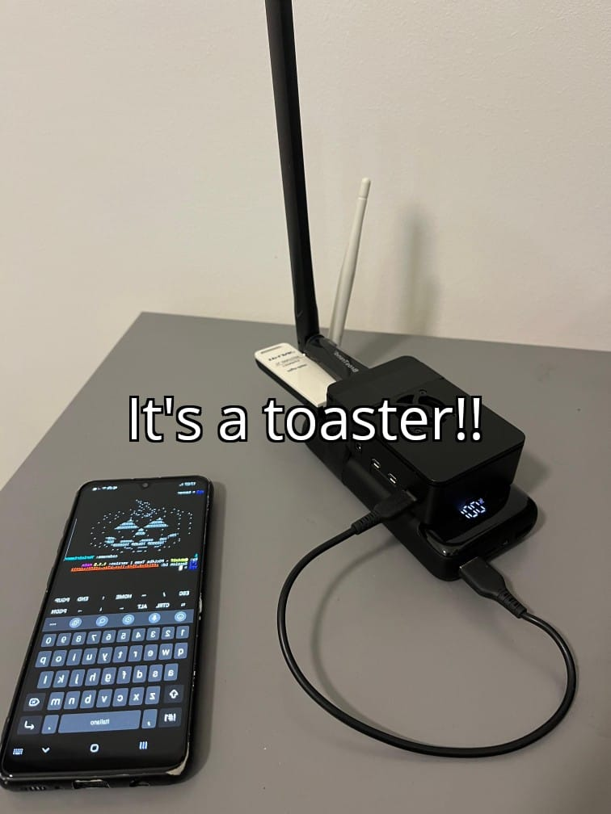

# reddit_removed_post
Configured and programmed raspberry pi to act as a rogue AP that i can control wirelessly from my phone to launch wireless phishing attacks from everywhere.

<!---

-->

## Disclaimer

Any malicious use of the contents from this repository, will not hold the author responsible, the contents are solely for educational purpose.

## Premise

So since I've been playing with raspberry pi rogue APs for a while now, I was planning on writing some documentation anyway.
Let it be clear that there is no magic recipe that always works, if you are interested you must take the time to understand and solve the problems you may encounter.

**Note:** the guide assumes that you know the principles of networking and you have linux command line skills.

## Design

I initially thought of this proof of concept project as a portable raspberry pi AP to carry around in a backpack that is controlled from a phone,
raspberry in my project has three wireless interfaces one integrated and two external usb connected ones:

- The first integrated interface (wlan0) works as a client and it's purpose is to get internet connection from android 4G hotspot 
(once the victim connects to the AP and you capture data you give them internet access to not raise suspects)  
and to control raspberry pi with ssh from your phone

- The second one (wlan1) spawns the rogue AP, it's the one wifipumpkin3 uses to capture data

- The third one (wlan2) is used to deauthenticate clients from their current AP redirecting them to the rogue one

**Note on the deauthentication part:**

If you run a deauth attack to an existing AP and your rogue AP has the same SSID of the one you are attacking, all the clients auto connect to your AP, **jackpot**!

## What you will need

For ease of use in the guide the role of wlan0 will be replaced with an ethernet connection using ethernet tethering from your android phone but you will need an ethernet to usb-c adapter and an ethernet cable
[<ins>https://www.reddit.com/r/raspberry_pi/comments/pm1kww/psa_you_can_use_android_11s_new_ethernet/</ins>](https://www.reddit.com/r/raspberry_pi/comments/pm1kww/psa_you_can_use_android_11s_new_ethernet/)

**Components:**

- A powerbank to connect your raspberry pi to
- A usb wireless network interface, one should be integrated in the pi (2 total wireless network interfaces)
- An ethernet to usb-c adapter
- An ethernet cable
- Your tethering ethernet capable android phone

## How it works 

What I'm going to explain is the most basic but also the most effective attack of the rogue AP, the **captive portal**:
when clients connect to your AP they are denied internet access until they enter some credentials in the portal that you then capture.
The portal can emulate any major authentication method like facebook, microsoft, etc. I uploaded a zip file that contains the code to 
implement a google fake login captive portal, but i'm not going to discuss how to install it in wifipumpkin3. 
Obviously this captive portals don't bypass 2FA if implemented but you could still capture emails and passwords.

**Google captive portal example:**

## Let's dive into it
**The following assumes that you implement the portable configuration, test with the screen connected to raspberry firsts and even without powerbank if you want.**
To start connect your wireless network adapter and powerbank to raspberry pi and turn it on.
Then connect your usb-c to ethernet adapter to your phone and ethernet cable to raspberry pi, activating tethering ethernet on Android.
Now from your phone you can scan the network (ethernet interface) with a network scanning app until you find the raspberry pi local ip address that is going to look something like 192.168.0.X,
then in termux `ssh username@raspberry-local-ip` (SSH must be enabled in the raspberry pi).
After you enter your password you should be logged in your raspberry pi from your phone.

I've uploaded two bash scripts in this repo one for deauthenticating `deauth.sh` needs **aircrack-ng** and **mdk4** installed in the raspberry pi,
one for starting the rogue AP `wifi2payloads.sh` needs **wifipumpkin3** installed on the pi.

After you installed all the dependecies:
- `sudo ./wifi2payloads.sh <wireless-interface> <ssid>`, then type & enter `start` in the console to spawn the rogue AP.
- open another termux session and `sudo ./deauth.sh` to deauth clients from their AP.

When clients connect you should see the network traffic on the screen of your phone and if credentials are entered in the portal they are also going to appear on the screen within the first termux session.

**Happy hacking!**
